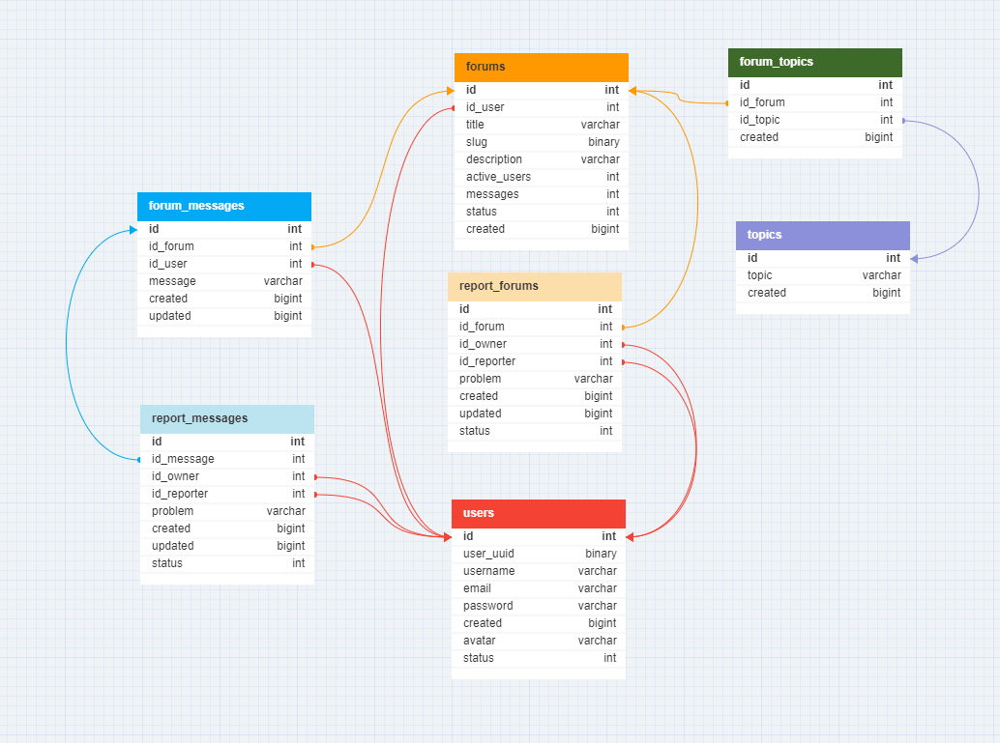

## Introduction
This is a REST API that has functionality as forum app backend,
I created this REST API as a portfolio project to demonstrate my skills in Go, MySQL, and JWT. I learned a lot about these technologies by working on this project, and I hope that it will help me to land a job as a software engineer.

## Tech stack
Tech stack that I used for build this is

[![Go][Go]][Go_URL] [![MYSQL][MYSQL]][MYSQL_URL] [![JWT][JWT]][JWT_URL]
<ul>
  <li>Go programming language</li>
  <li>MYSQL</li>
  <li>JWT</li>
 </ul>
 
 Lib that I used on this project
 
* [github.com/go-sql-driver/mysql](https://github.com/go-sql-driver/mysql)
* [github.com/golang-jwt/jwt](https://github.com/golang-jwt/jwt)
* [github.com/google/uuid](https://github.com/google/uuid)
* [github.com/gorilla/mux](https://github.com/gorilla/mux)
* [github.com/joho/godotenv](https://github.com/joho/godotenv)
* [github.com/stretchr/testify](https://github.com/stretchr/testify)
* [golang.org/x/crypto](https://pkg.go.dev/golang.org/x/crypto)

[Go]: https://img.shields.io/badge/go-%2300ADD8.svg?style=for-the-badge&logo=go&logoColor=white
[Go_URL]: https://go.dev/
[MYSQL]: https://img.shields.io/badge/mysql-%2300f.svg?style=for-the-badge&logo=mysql&logoColor=white
[MYSQL_URL]: https://www.mysql.com/
[JWT]: https://img.shields.io/badge/JWT-black?style=for-the-badge&logo=JSON%20web%20tokens
[JWT_URL]: https://jwt.io/

[driver]: https://github.com/go-sql-driver/mysql


## Features
#### Auth
<ul>
  <li>Register</li>
  <li>Login</li>
</ul>

```sh
  router.HandleFunc("/register", authHandler.Register).Methods("POST")
  router.HandleFunc("/login", authHandler.Login).Methods("POST")
 ```

#### Forum
<ul>
  <li>Get All Forum</li>
  <li>Create Forum</li>
  <li>Get Forum by Id</li>
  <li>Update Forum</li>
  <li>Delete Forum</li>
  <li>Search Forum</li>
  <li>Report Forum</li>
</ul>

```sh
    router.HandleFunc("/forums", forumHandler.Forums).Methods("GET")
    router.HandleFunc("/forums", middleware.AuthMiddleware(forumHandler.Create)).Methods("POST")
    router.HandleFunc("/forums/{id}", forumHandler.ById).Methods("GET")
    router.HandleFunc("/forums/{id}", middleware.AuthMiddleware(forumHandler.Update)).Methods("PUT")
    router.HandleFunc("/forums/{id}", middleware.AuthMiddleware(forumHandler.Delete)).Methods("DELETE")
    router.HandleFunc("/forums/search", forumHandler.FindForum).Methods("POST")
    router.HandleFunc("/forums/{id}/report", middleware.AuthMiddleware(reportForumHandler.Create)).Methods("POST")
```

#### Message
<ul>
  <li>Read Message(see all messages on a forum)</li>
  <li>Create Message(send a message on a forum)</li>
  <li>Update Message</li>
  <li>Delete Message</li>
  <li>Report Message</li>
  <li>Search Message(search a message on a forum)</li>
</ul>

```sh
    router.HandleFunc("/forums/{id_forum}/messages", messageHandler.ByIdForum).Methods("GET")
    router.HandleFunc("/forums/{id_forum}/messages", middleware.AuthMiddleware(messageHandler.Create)).Methods("POST")
    router.HandleFunc("/forums/{id_forum}/messages/{id}", middleware.AuthMiddleware(messageHandler.Update)).Methods("PUT")
    router.HandleFunc("/forums/{id_forum}/messages/{id}", middleware.AuthMiddleware(messageHandler.Delete)).Methods("DELETE")
    router.HandleFunc("/forums/{id_forum}/messages/{id}/report", middleware.AuthMiddleware(reportMessageHandler.Create)).Methods("POST")
    router.HandleFunc("/forums/{id}/searchmsg", forumHandler.FindMsg).Methods("POST")
```

## Database Schema
Database on this REST API consists of 7 tables



